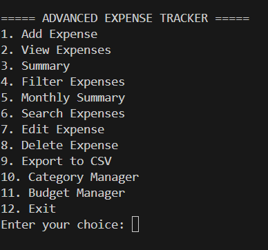
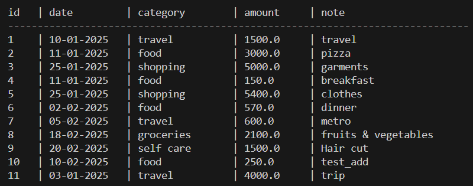
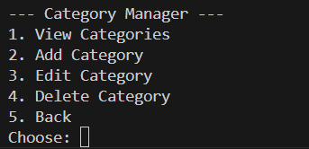

# Advanced Expense Tracker (Python + SQLite3)

A command-line application to record, manage, categorize, and analyze daily expenses with budget alerts and filtering tools. Built using Python and SQLite.

---

## Features

- Add, view, edit, and delete expenses  
- Search expenses by keyword  
- Filter by date, category, or a date range  
- Monthly summary (overall + category breakdown)  
- Category Manager (add, edit, delete categories)  
- Budget Manager with automatic budget alerts  
- Export expenses to CSV  
- Clean, formatted table output in terminal  

---

## Tech Stack

- Python 3  
- SQLite3 (built-in)  
- CSV (built-in)  

---

## Project Structure

```
expense_app/
│
├── main.py
├── database.py
├── expenses.db
│
└── screenshots/
    ├── menu.png
    ├── table_view.png
    ├── category_manager.png
    └── budget_alert.png
```

---

## Screenshots

### Main Menu  


### Table View  


### Category Manager  


### Budget Alert  


---

## Installation & Setup

Follow these steps to run the project on your system:

### 1. Clone the Project
```
git clone <your-repository-link>
cd expense_app
```

### 2. Verify Python Installation
```
python --version
```

### 3. Run the Application
```
python main.py
```

---

## Database Information

- SQLite database stored in `expenses.db`  
- Tables auto-created by `create_table()`  
- Recreated automatically if deleted  

---

## Usage Overview

- Add, view, edit, delete expenses  
- Search and advanced filtering  
- Category & budget management  
- CSV export  
- Automatic budget alerts  

---
## How to Use

1. Run the application:
   python main.py

2. Choose an option from the menu:
   - Add Expense
   - View Expenses
   - Edit / Delete Expenses
   - Manage Categories
   - Set Budgets

3. Follow on-screen prompts to enter data.

4. Budget warnings will appear automatically if limits are exceeded.

5. Use Export option to save data as CSV.


## Future Enhancements

- PDF reports  
- GUI (Tkinter / PyQt)  
- Charts and visual analytics  
- Cloud sync (Firebase / Supabase)  
- Login system  

---

## License

MIT License

## Testing

The application was manually tested using the following scenarios:

- Added multiple expenses with different categories and dates
- Verified table view formatting for expenses
- Edited and deleted existing expenses
- Tested category creation, update, and deletion
- Set category budgets and confirmed warning alerts on limit exceed
- Exported expense data to CSV successfully
- Restarted application to confirm data persistence

All features worked as expected during testing.
